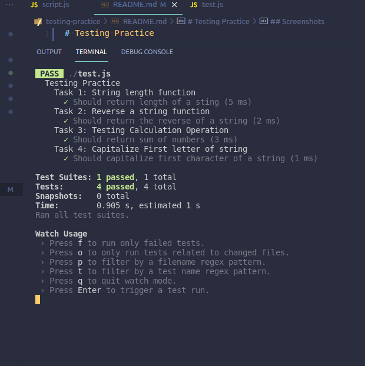

# Testing Practice

Testing functions using jest

## Screenshots

## Built With

- JS

## Getting Started

**To clone this project**
**Run command: $git clone https://github.com/wuyepabdul/testing-practice**
**or press the green Code button in the upper right corner and choose to download from the Download ZIP link.**

### Prerequisites

- Code editor (VS Code, Sublime, Atom)

## Authors

👤 **Author1**

- GitHub:[@Wuyep Abdul](https://www.github.com/wuyepabdul)
- LinkedIn:[@Abdul_Wuyep](https://www.linkedin.com/in/abdul-wuyep-6a27721b8/)

## Show your support

Give a ⭐️ if you like this project!

## 📝 License

This project is [MIT](./MIT.md) licensed.
